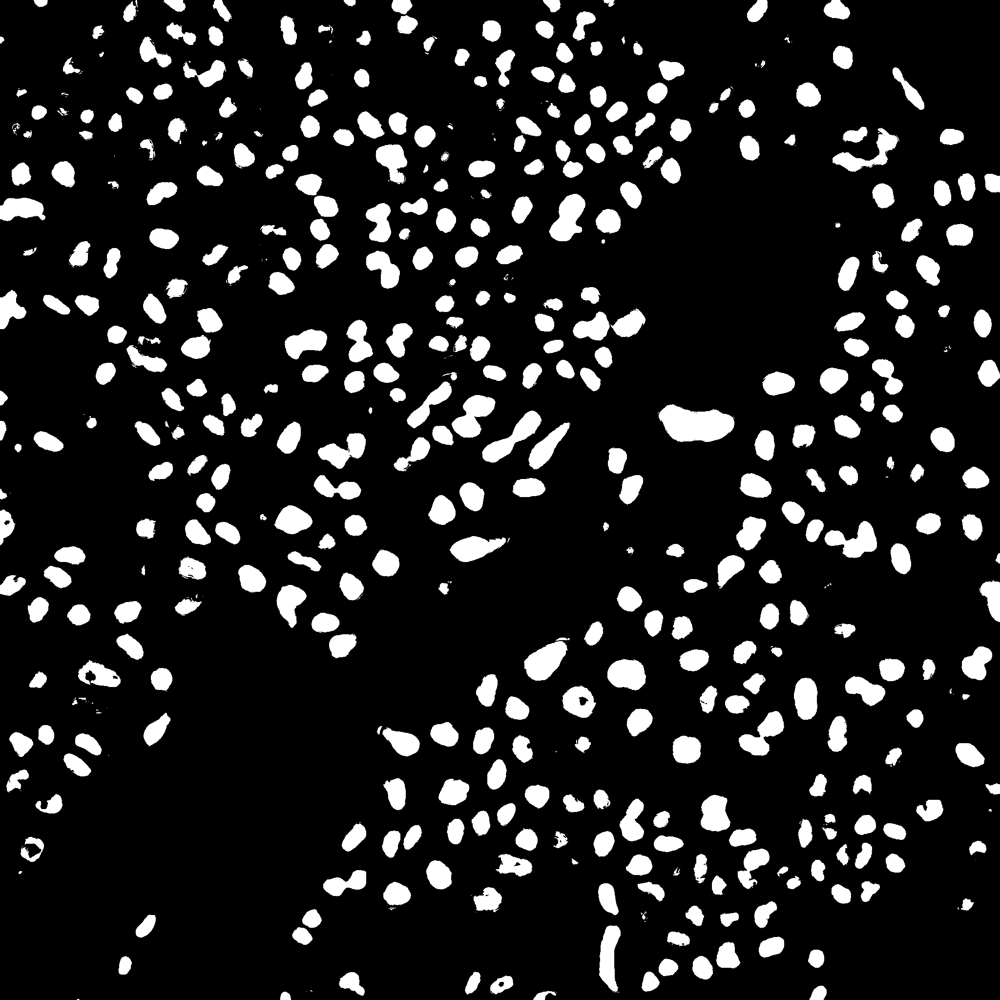

## 需求分解

>细胞识别后，将每个细胞为中心，分割为单个细胞的小图，使每个小图包含一个细胞，小图统一大小，尽量都能包含完整的细胞即可。由于细胞识别错误，小图中存在错误的细胞（如粘连，模糊等情况），需要去除这些细胞。你们人工对每个细胞小图给于标签（正确的细胞标记1，错误细胞标记0）。利用CNN训练出模型，对每个小图进行打分，最后结合人工标记，画出模型的auc。

### 细胞识别
* 使用opencv-python框架来实现，处理路线为：降噪——滤波——灰度化——二值化——轮廓识别

* 代码实现：

```Python3
def findContours(image): 
    '''
        返回所有细胞轮廓
    '''
    
    image            = cv2.fastNlMeansDenoisingColored(image, None, 15, 15, 7, 21)
    blur_img         = cv2.medianBlur(image,5)
    image            = cv2.cvtColor(image, cv2.COLOR_BGR2GRAY)
    image            = cv2.adaptiveThreshold(image, 255, 
                       cv2.ADAPTIVE_THRESH_GAUSSIAN_C, 
                       cv2.THRESH_BINARY,
                       289,
                       -3)  # 关键参数
    
    cv2.imwrite('二值化.png', image)
    
    _, contours, _   = cv2.findContours(image, 
                       cv2.RETR_TREE,
                       cv2.CHAIN_APPROX_SIMPLE)
                       
    return contours
```

### 分割细胞
#### 分割正样本
* 将原图分割为统一大小的单个细胞小图，还是使用opencv-python来实现，技术路线为：找轮廓的外接矩形——根据矩形范围筛选轮廓——找矩形的中点——以[x-20:x+20, y-20:y+20]为范围裁剪小图，以列表形式返回

* 有待后续筛选和标记，代码实现为：
```Python3
def generateTrueCell(image, contours):
    '''
        使用40*40的矩形框进行裁剪，并以列表类型返回所有细胞小图
        后续：删除错误数据、人工给予标记
    '''

    images_list      = []

    for i,contour in enumerate(contours):
        x, y, w, h   = cv2.boundingRect(contour)

        center_x     = int(x+ w/2)
        center_y     = int(y+ h/2) 

        if min( w,h ) > 10 and max( w,h ) < 50:         
            new_image= image[center_y-20:center_y+20,center_x-20:center_x+20]
            
            if new_image.shape[0] == new_image.shape[1]:
                images_list.append(new_image)

    return images_list
```
#### 分割负样本
* 使用随机数发生器随机产生的点作为40*40矩形框的中点，对原图进行裁剪，再进行人工筛选，形成负样本。以列表形式返回

* 代码实现：
```Python3
def generateFakeCell(image, k):
    images_list      = []
    random.seed      = 5
    for i in range(k):
        center_x     = randint(20, image.shape[0]-20)
        center_y     = randint(20, image.shape[1]-20)
        new_image    = image[center_y-20:center_y+20, center_x-20:center_x+20]
        images_list.append(new_image)
    
    return images_list
```
### 筛选样本
* 使用opencv-python对样本的列表进行遍历，对不符合要求的样本进行剔除，将剩余样本以列表形式返回

* 代码实现：
```Python3
def keepStandardPic(images_list):
    '''
        使用for循环进行遍历，依次显示每张图片并进行删除标记
        删除存在多个细胞粘连的图片
    '''

    for index, pic in enumerate(images_list):
        p= cv2.resize(pic,(600,600),interpolation=cv2.INTER_CUBIC)
        cv2.imshow('image'+str(index), p)
        cv2.waitKey(0)
        cv2.destroyAllWindows()
        
        remove       = input('remove this pic? y/[n] :')
        
        if remove    == 'y':
            images_list.pop(index)
    
    return images_list
```

### 模型构建
* 使用tensorflow2.0中的keras模块构建卷积神经网络，使用**两个卷积、两个池化层和全连接层**来搭建一个较为基础的图片分类网络。

* 代码实现
```Python3
def buildModel(x_train):
    model          = tf.keras.Sequential()
    model.add(tf.keras.layers.Conv2D(
        input_shape=(x_train.shape[1], x_train.shape[2], x_train.shape[3]),
        filters=32, 
        kernel_size=(3,3), 
        strides=(1,1), 
        padding='valid', 
        activation='relu')
    )

    model.add(tf.keras.layers.MaxPool2D(pool_size=(2,2)))
    model.add(tf.keras.layers.Conv2D(
        filters=64, 
        kernel_size=(3,3), 
        strides=(1,1), 
        padding='valid', 
        activation='relu')
    )

    model.add(tf.keras.layers.MaxPool2D(pool_size=(2,2)))
    model.add(tf.keras.layers.Flatten())
    model.add(tf.keras.layers.Dense(32, activation='relu'))
    model.add(tf.keras.layers.Dense(10, activation='softmax'))
```

## 效果展示

### 0_generateData.py
```Python3
# 运行于另一台server，因为薛老师的server配置opencv出错了（无法运行cv2.imshow()），需要su权限才能装依赖包。

import cv2
import os
from matplotlib import pyplot as plt
from random import sample,randint


def findContours(image): 
    '''
        返回所有细胞轮廓
    '''
    
    image            = cv2.fastNlMeansDenoisingColored(image, None, 15, 15, 7, 21)
    blur_img         = cv2.medianBlur(image,5)

    image            = cv2.cvtColor(image, cv2.COLOR_BGR2GRAY)
    image            = cv2.adaptiveThreshold(image, 255, \
                       cv2.ADAPTIVE_THRESH_GAUSSIAN_C, \
                       cv2.THRESH_BINARY, 289, -3)
    
    cv2.imwrite('二值化.png', image)
    _, contours, _   = cv2.findContours(image, 
                       cv2.RETR_TREE,
                       cv2.CHAIN_APPROX_SIMPLE)
    
    print('\tfound contours')
    c                = cv2.drawContours(image, contours, -1,(0,255,0), 1)
    return contours


def generateTrueCell(image, contours):
    '''
        使用40*40的矩形框进行裁剪，并以列表类型返回所有细胞小图
        后续：删除错误数据、人工给予标记
    '''

    images_list      = []

    for i,contour in enumerate(contours):
        x, y, w, h   = cv2.boundingRect(contour)

        center_x     = int(x+ w/2)
        center_y     = int(y+ h/2) 

        if min( w,h ) > 10 and max( w,h ) < 50:         
            new_image= image[center_y-20:center_y+20,center_x-20:center_x+20]
            
            if new_image.shape[0] == new_image.shape[1]:
                images_list.append(new_image)

    return images_list


def generateFakeCell(image, k):
    images_list      = []
    random.seed      = 5
    for i in range(k):
        center_x     = randint(20, image.shape[0]-20)
        center_y     = randint(20, image.shape[1]-20)
        new_image    = image[center_y-20:center_y+20, center_x-20:center_x+20]
        images_list.append(new_image)
    
    return images_list


def keepStandardPic(images_list):
    '''
        使用for循环进行遍历，依次显示每张图片并进行删除标记
        删除存在多个细胞粘连的图片
    '''

    for index, pic in enumerate(images_list):
        p= cv2.resize(pic,(600,600),interpolation=cv2.INTER_CUBIC)
        cv2.imshow('image'+str(index), p)
        cv2.waitKey(0)
        cv2.destroyAllWindows()
        
        remove = input('remove this pic? y/[n] :')
        
        if remove=='y':
            images_list.pop(index)
    
    return images_list


if __name__ == '__main__':
    data             = {}
    image            = cv2.imread('cell.png')                    # 读取图片
    contours         = findContours(image)                       # 识别轮廓

    trueCell_keep    = generateTrueCell(image, contours)         # 生成正样本
    print('filtering true cell!')
    # trueCell_keep  = keepStandardPic(trueCell)                 # 筛选正样本
    # 看起来都像细胞，所以注释掉了                                                            
    data['trueCell'] = trueCell_keep 
    data['trueLabel']= ['1']*len(trueCell_keep)                  # 标记经过筛选的正样本为 1

    fakeCell         = generateFakeCell(image, 20)               # 从原图中随机裁剪出负样本
    print('filtering fake cell!')
    fakeCell_keep    = keepStandardPic(fakeCell)*20              # 筛选负样本
    data['fakeCell'] = fakeCell_keep
    data['fakeLabel']= ['0']*len(fakeCell_keep)                  # 标记经过筛选的负样本为 0 

    directory= '/home/u201713020/Desktop/cell_classification/src/'
                                                                 # 路径为绝对路径（另一台server）
    data_merge = {'cell': data['trueCell'] + data['fakeCell'],   # 合并数据
        'label': data['trueLabel'] + data['fakeLabel']}

    if not os.path.isdir(directory):                             # 保存数据
        os.makedirs(directory)
    
    for index,pic in enumerate(data_merge['cell']):
        dir= directory + 'data/'
        if not os.path.isdir(dir):
            os.makedirs(dir)
        cv2.imwrite(dir+'cell_'+str(index)+'.png', pic)
    
    f=open(directory+'label.txt', 'w')
    f.write( ','.join(data_merge['label']) )
    f.close()
```
* 二值化结果展示
<center>
{width=60%}
</center>
* 正样本——负样本对照
<center>
{width=60%}
</center>

<center>非原图，经过亮度调整</center>

### trainModel.py
```Python3
# 运行于薛老师的server。

import cv2
import tensorflow as tf
import numpy as np
from sklearn.model_selection import train_test_split
from sklearn.metrics import roc_curve, auc

import matplotlib.pyplot as plt

def loadData():
    data={'cell':[]}
    directory= '/home/xueyu/ch379/cell_classification/src/'

    for i in range(438):
        image= cv2.imread(directory+'/data/cell_'+str(i)+'.png')
        data['cell'].append(image)
    
    f=open(directory+'label.txt')
    label_read= f.read().split(',')
    f.close()
    
    l= list(map(int, label_read))
    data['label']= l
    
    return data


def buildModel(x_train):
    model= tf.keras.Sequential()
    model.add(tf.keras.layers.Conv2D(
        input_shape=(x_train.shape[1], x_train.shape[2], x_train.shape[3]),
        filters=32, 
        kernel_size=(3,3), 
        strides=(1,1), 
        padding='valid', 
        activation='relu')
    )

    model.add(tf.keras.layers.MaxPool2D(pool_size=(2,2)))
    model.add(tf.keras.layers.Conv2D(
        filters=64, 
        kernel_size=(3,3), 
        strides=(1,1), 
        padding='valid', 
        activation='relu')
    )

    model.add(tf.keras.layers.MaxPool2D(pool_size=(2,2)))
    model.add(tf.keras.layers.Flatten())
    model.add(tf.keras.layers.Dense(32, activation='relu'))
    model.add(tf.keras.layers.Dense(10, activation='softmax'))
    
    return model


def plot_roc_curve(fper, tper):  
    plt.plot(fper, tper, color='orange', label='ROC')
    plt.plot([0, 1], [0, 1], color='darkblue', linestyle='--')
    plt.xlabel('False Positive Rate')
    plt.ylabel('True Positive Rate')
    plt.title('Receiver Operating Characteristic (ROC) Curve')
    plt.legend()
    plt.savefig('roc_curve.png')


if __name__=="__main__":

    data= loadData()                                             # 导入数据
    x_train, x_test, y_train, y_test = train_test_split(np.array(data['cell']),
    np.array(data['label']),
    test_size=0.2,
    random_state=3)                                              # 分割样品

    model= buildModel(x_train)                                   # 建立模型
    model.compile(optimizer=tf.keras.optimizers.Adam(lr=0.001),
                loss=tf.keras.losses.SparseCategoricalCrossentropy(),
                metrics=['accuracy']
                )
                
    model.summary()
    
    model.fit(x_train, y_train, epochs=200)                      # 训练模型
    res = model.evaluate(x_test, y_test)                         # 评估
    
    y_pred = model.predict_classes(tf.cast(x_test, tf.float32))  # 预测
    
    fper, tper, thresholds = roc_curve(y_test, y_pred)           # 画ROC，计算AUC
    plot_roc_curve(fper, tper)
    AUC= auc(fper, tper)
    
    r=open('classifier.result', 'w')                             # 写入测试结果
    r.write('y_test\n'+','.join(list(map(str, y_test)))+'\n\n')
    r.write('y_prediction\n'+','.join(list(map(str, y_pred))))
    r.close()

    model.save('classifier_ch379.h5')                            # 保存模型
    print('loss: {}, accuracy: {}'.format(res[0], res[1]))
    print('AUC: ', AUC)
```
#### 结果展示
设置学习率为**0.001**，经过**200**个epoch迭代后得到输出

* loss: **0.004890307782819615**, accuracy: **1.0**
* AUC:  **1.0**

* roc curve
<center>
{}
</center>

* 测试标签（y_test）和预测的标签（y_prediction）
```
y_test
1,1,0,1,1,1,1,0,1,1,1,0,0,0,0,0,0,1,0,1,0,1,0,1,1,0,1,0,0,1,0,1,1,1,1,0,0,1,1,1,1,0,0,0,1,0,0,0,0,1,1,1,0,1,0,0,0,0,1,1,0,0,0,1,0,1,1,0,0,1,1,0,1,0,1,1,1,0,0,1,1,1,0,0,1,1,1,0

y_prediction
1,1,0,1,1,1,1,0,1,1,1,0,0,0,0,0,0,1,0,1,0,1,0,1,1,0,1,0,0,1,0,1,1,1,1,0,0,1,1,1,1,0,0,0,1,0,0,0,0,1,1,1,0,1,0,0,0,0,1,1,0,0,0,1,0,1,1,0,0,1,1,0,1,0,1,1,1,0,0,1,1,1,0,0,1,1,1,0
```
